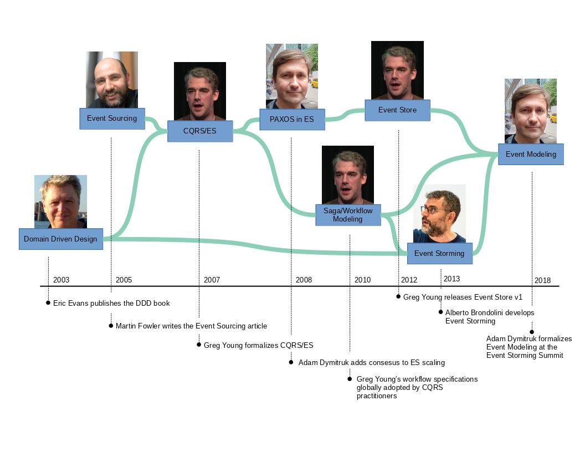

# Awesome Event Modeling 

> A curated list of awesome resources (articles / videos / courses / repositories) about Event Modeling.

Event Modeling is a method of describing systems using an example of how information has changed within them over time.
Specifically this omits transient details and looks at what is durably stored and what the user sees at any particular
point in time. These are the events on the timeline that form the description of the system.

Event Modeling was coined by [Adam Dymitruk](https://github.com/adymitruk/) by building on long-running process
specifications that Greg Young used in CQRS/ES systems. Alberto
Brandolini’s [Event Storming](https://github.com/mariuszgil/awesome-eventstorming) sticky notes and collaboration was
integrated to adopt the workshop format. The final piece was the UI/UX aspects to complete what more resembles a movie
story board. In the recent years many organizations were able to get on the same page with all departments and get their
projects done with much greater efficiency.

Event Modeling history from [HERE](https://eventmodeling.org/about/).

> 🚀 Go ahead to the official web page here: 🌐 https://eventmodeling.org

## Getting Started
1. Read official introduction from Adam Dymitruk: [Event Modeling: What is it?](https://eventmodeling.org/posts/what-is-event-modeling/)
2. See Event Modeling Cheat Sheet by Sebastian Bortz: [EventModeling Cheat Sheet](https://eventmodeling.org/posts/event-modeling-cheatsheet/)

## 📕 Articles

- [eventmodeling.org | Event Modeling: What is it?](https://eventmodeling.org/posts/what-is-event-modeling/) - Adam Dymitruk
- [eventmodeling.org | Event Modeling Traditional Systems](https://eventmodeling.org/posts/event-modeling-traditional-systems/) -
  Adam Dymitruk
- [eventmodeling.org | Great User Experience Demands Event Modeling](https://eventmodeling.org/posts/user-experience-event-modeling/) -
  Eric Lau
- [eventmodeling.org | EventModeling Cheat Sheet](https://eventmodeling.org/posts/event-modeling-cheatsheet/) -
  Sebastian Bortz
- [eventmodeling.org | Natural Human Thinking - Event Storming vs Event Modeling](https://eventmodeling.org/posts/human-natural-thinking/) -
  Rafał Maciąg
- [zycienakodach.pl | Event Modeling & Modularny Monolit | Od kolorowych karteczek do kodu poprzez TDD](https://zycienakodach.pl/event-modeling-modularny-monolit) (🇵🇱 Polish) - Mateusz Nowak
- [InfoQ | Interview with Event Modeling Founder - Adam Dymitruk](https://www.infoq.com/news/2020/09/adameventmodeling/)
- [Goeleven.com | WHAT IS EVENT MODELING? (WITH EXAMPLE)](https://www.goeleven.com/blog/event-modeling/)
- [Event Modeling - A New Approach to Software Design](https://www.infoq.com/articles/event-modeling/)

## 📺 Videos

> Official Event Modeling YouTube channel: [Event-Driven Information Systems](https://www.youtube.com/@eventmodeling)

- [Event Modeling Workshop - Adam Dymitruk](https://www.youtube.com/watch?v=gyhR5Wey6_s) - Full mini-workshop for InfoZone.se on Event Modeling.
- [Guidance Using Event Modeling](https://www.youtube.com/watch?v=sr3pMaLHYyQ&)
- [Copenhagen DDD Event Modeling with Adam Dymitruk](https://www.youtube.com/watch?v=U_MwAEf8V_A)
- [Event Modeling and Wardley Mapping with Chris Daniel](https://www.youtube.com/watch?v=FykEYRUrasI)
- [OAuth2 Event Modeling in Go](https://www.youtube.com/watch?v=32lvL_Un8ko)
- [Event Sourcing, Event Modeling and Event Storming](https://www.youtube.com/watch?v=tkn1p7LUY2o)
- [Event Modeling and Wardley Mapping with Chris Daniel](https://www.youtube.com/watch?v=FykEYRUrasI)
- [Event Modeling a Time Tracking System](https://www.youtube.com/watch?v=Ok_V2VDy-ns)
- [Sagas Don't Exist](https://www.youtube.com/watch?v=Q4iVt8GeOsE&t)
- [CQRS and Event Sourcing Introduction with Greg Young](https://www.youtube.com/watch?v=AspkNFjhHIM)
- [Small Design Up-Front Removes Agile](https://www.youtube.com/watch?v=mCZ8xQlR5yY)
- [MrDev.pl | Krzysztof Owsiany | Moje 5 minut](https://www.youtube.com/playlist?list=PLfQV-LT-sb2EwGOdnnow-2hXPH0l6URt1) (🇵🇱 Polish)

## 🎙️ Podcasts

- [ADD DOT | Event Modeling and Event Sourcing](https://play.acast.com/s/add-dot/adam-dymitruk) - host: Vaughn Vernon
- [devsession.pl | Event Modeling – Rafał Maciąg](https://devsession.pl/event-modeling/) (🇵🇱 Polish) - host: Grzegorz
  Kotfis

## 🛠️ Tools with Event Modeling support

Whiteboards and everything else with can help you lead Event Modeling workshop.

- [miro](https://miro.com/)
    - Templates:
        - [eventmodeling.org | Event Modeling Cheat Sheet](https://miro.com/app/board/uXjVOia7ydY=/?share_link_id=194982904636)
    - Examples:
        - [eventmodeling.org | Event Modeling Tutorial: Time Tracking System](https://miro.com/app/board/o9J_lNYWcsI=/) 
        - [eventmodeling.org | TODO List](https://eventmodeling.org/event-modeling.rtb)
        - [mrdev.pl | Krzysztof Owsiany | CatchTheFlow](https://miro.com/app/board/o9J_kwQS0ls=/) + [Git (implementation)](https://gemustudio.visualstudio.com/_git/CatchTheFlow)
        - [ZycieNaKodach.pl | Mateusz Nowak | Table Soccer Tournaments system](https://miro.com/app/board/o9J_lOEebqI=/?moveToWidget=3074457356075616433&cot=14) + [GitHub (implementation)](https://github.com/MateuszNaKodach/CodersCamp2020.Project.FullStack-Node-React.TableSoccerTournaments/tree/develop/backend)
        - [ZycieNaKodach.pl | Mateusz Nowak | Programming course management system](https://miro.com/app/board/o9J_lQvnN28=/?moveToWidget=3074457362407512031&cot=14) + [GitHub (implementation)](https://github.com/MateuszNaKodach/coderscamp/tree/main/packages/api/src/module)
        - [ZycieNaKodach.pl | Mateusz Nowak | StarWars Quiz](https://miro.com/app/board/o9J_kg8fTO4=/?moveToWidget=3074457351245562568&cot=12) - for frontend development bootcamp
        - [ZycieNaKodach.pl | Mateusz Nowak | Event Modeling workshops based on GitHub domain](https://miro.com/app/board/o9J_lOPDQoc=/?share_link_id=595878799640)(🇵🇱 Polish) + [GitHub (implementation) - DDD.EventSourcing.EventModeling.Kotlin.NodeJS.DotNet.GitHubClone](https://github.com/MateuszNaKodach/DDD.EventSourcing.EventModeling.Kotlin.NodeJS.DotNet.GitHubClone)
- [Figma](https://www.figma.com/)
    - Templates:
        - [EventStorming | ZycieNaKodach.pl](https://www.figma.com/community/file/1090711660464730523)
    - Examples:
- [draft.io](https://draft.io/)
    - Templates:
      - [Event Modeling](https://draft.io/example/event-modeling)
- [oNote](https://www.onote.com/)
- [Modellution (beta)](https://www.modellution.com/)
- [prooph BOARD](https://prooph-board.com/)
  - Examples:
    - [Event Modeling](https://free.prooph-board.com/inspectio/board/fa333058-226b-424c-b48a-8663c44fb0ea)

## 🧑🏻‍💻 Code examples

Repositories with software implementations from Event Modeling

// TODO: WAITING FOR YOUR CONTRIBUTIONS
- [fmodel | Restaurant System](https://github.com/fraktalio/fmodel-demos)

## 💬 Online Communities

- [Event Modeling Slack](https://join.slack.com/t/eventmodeling/shared_invite/enQtNzE0NjAyMjMwNjQ2LTY1NjgzZWI4ZjE0NmM0MWU0OGQwNjA3ZTZkZWViYWUzMTRjZWViYzdhZWMzNWMwZjQyM2VhMWVjZWQ5NjNjMjU) - leaded by Adam Dymitruk

## Courses & Workshops

Please mark if they are free (🆓) or paid (💰).

- [Vaughn Vernon’s IDDD Workshop Series | Event Modeling & Event Sourcing ](https://kalele.io/training/event-modeling-event-sourcing/)(💰 latest price: ???)

## Companies

Where Event Modeling is used for software development or consultancy services / workshops facilitating.

- [Adaptech Group](https://adaptechgroup.com/) - CEO/Founder: Adam Dymitruk

## Contribute

Contributions welcome! Read the [contribution guidelines](contributing.md) first.